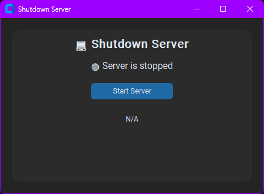

# 🔥 ShutItDown

ShutItDown is a sleek, user-friendly desktop app that allows you to instantly shut down your Windows PC remotely using your phone or any other device on the same network. Featuring a modern interface, convenient system tray integration, and zero-configuration setup, turning off your PC has never been easier.

## ✨ Key Features
- **Modern UI**: Clean, intuitive, and visually appealing interface created using CustomTkinter.
- **Remote Shutdown**: Turn off your PC from your phone or tablet using a simple URL.
- **System Tray Integration**: Minimize the app to the system tray to keep your workspace clean.
- **Flask Webserver**: Reliable local server running securely on your network, no cloud required.

## 🚀 How to Use

### Installation

First, clone the repository:
```bash
git clone https://github.com/yyyutakaaa/ShutItDown.git
cd ShutItDown
```

Next, install all required dependencies:
```bash
pip install -r requirements.txt
```

Finally, start the app:
```bash
python Shutdown.py
```

### 📱 Shutdown from Your Phone

Ensure your phone or other device is connected to the same Wi-Fi network as your PC, then open your browser and navigate to:
```
http://[your-pc-ip-address]:5050/shutdown
```

Your PC will shut down immediately!

## 🛠️ Requirements
- Windows 10/11
- Python 3.10 or higher

## 🔒 Important Notice
Use this app only in a trusted environment. Never enable port forwarding without proper security measures.

## 💡 Suggestions or Contributions?
Feel free to open an issue or submit improvements through pull requests!

## 📸 Screenshots

---

### 🚧 Future Enhancements
- Security improvements with secret codes or passwords.
- Additional functionalities like reboot and sleep modes.

Enjoy using ShutItDown! ✌️

